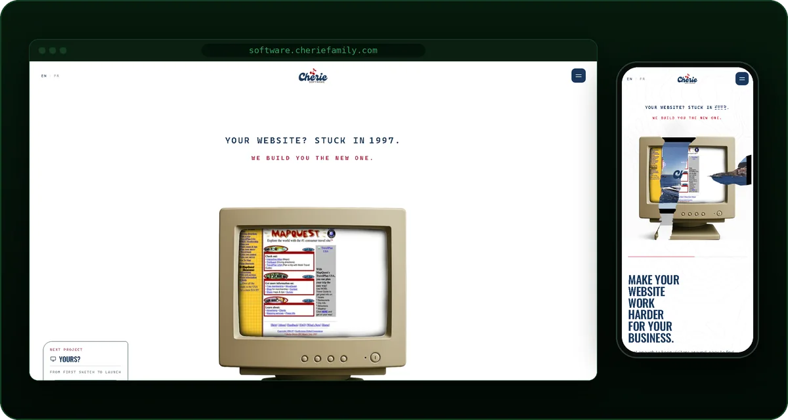
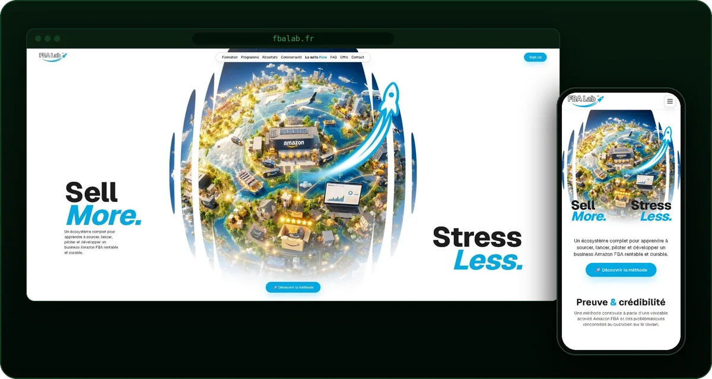
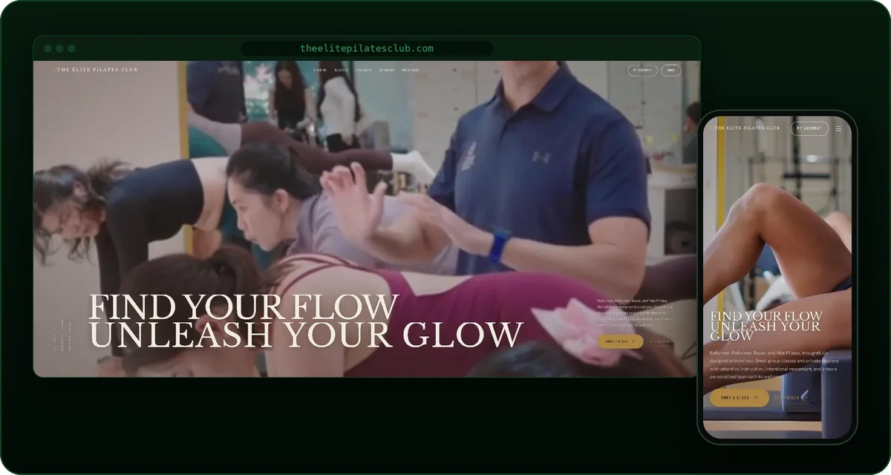
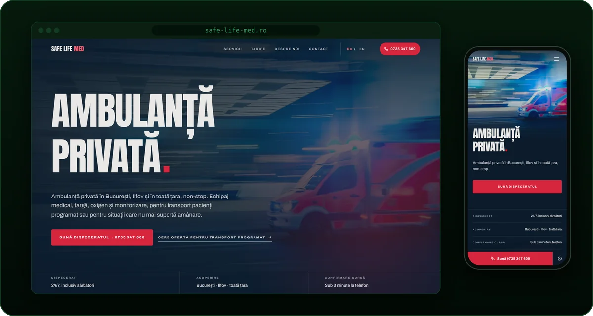
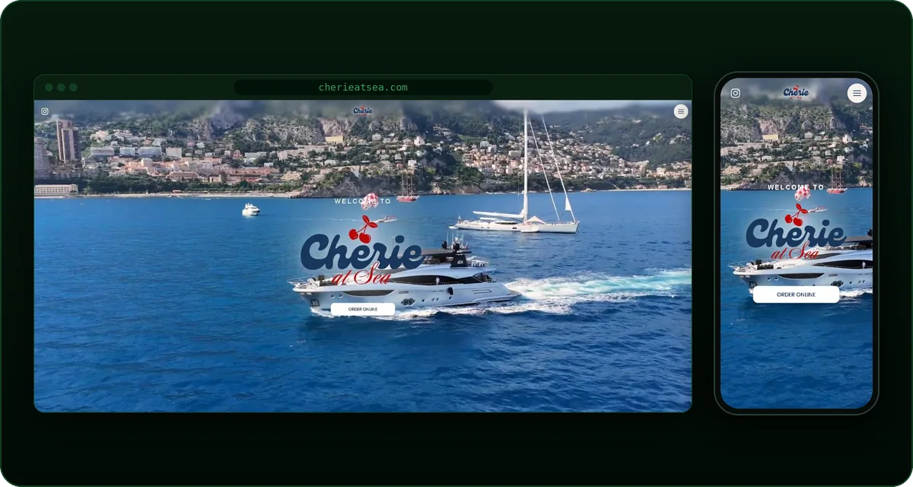
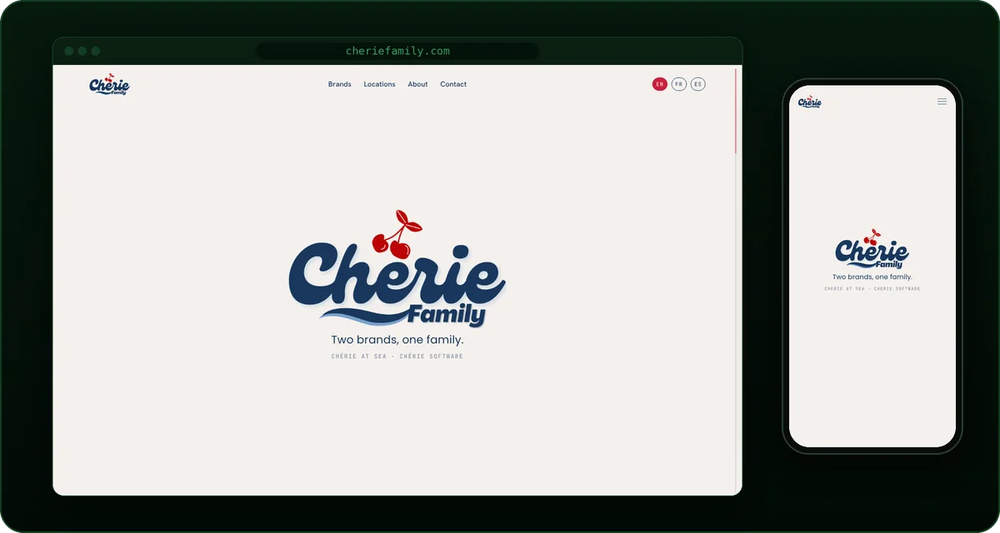
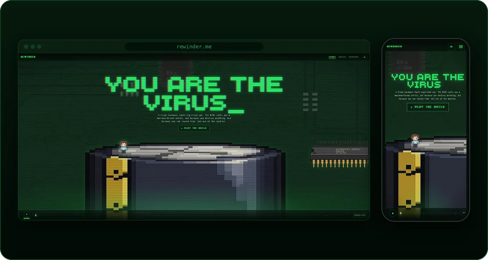
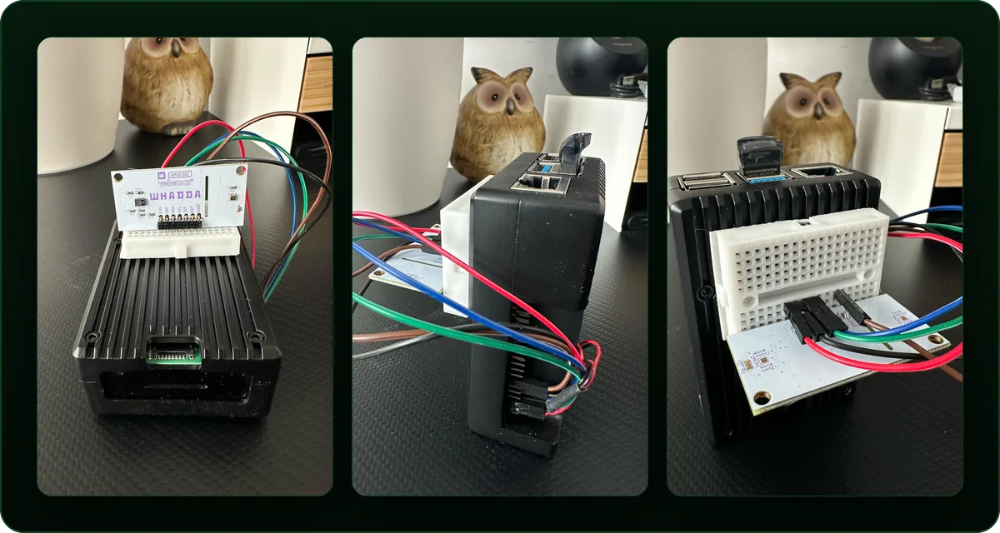

 

Full-stack dev from Romania, based in France. I build websites and run the servers they live on.

#### Stack

#### Projects

<table>
<tr>
<td width="50%" valign="top">

<b><a href="https://software.cheriefamily.com/">Chérie Software</a></b> · my web studio 
Next.js
</td>
<td width="50%" valign="top">

<b><a href="https://fbalab.fr/">FBA Lab</a></b> · Amazon FBA course platform and SaaS tools 
Next.js · MongoDB · Stripe
</td>
</tr>
<tr>
<td width="50%" valign="top">

<b><a href="https://theelitepilatesclub.com/">The Elite Pilates Club</a></b> · class booking and memberships 
Next.js · Supabase
</td>
<td width="50%" valign="top">

<b><a href="https://safe-life-med.ro/">Safe Life Med</a></b> · private ambulance service, RO/EN 
Next.js
</td>
</tr>
<tr>
<td width="50%" valign="top">

<b><a href="https://www.cherieatsea.com/">Chérie at Sea</a></b> · yacht and villa provisioning 
React · Vite
</td>
<td width="50%" valign="top">

<b><a href="https://cheriefamily.com/">Chérie Family</a></b> · brand site for the Chérie group 
Next.js
</td>
</tr>
<tr>
<td width="50%" valign="top">

<b><a href="https://www.rewinder.me/">Rewinder</a></b> · 2D time-rewind platformer, coming to Steam 
Unity · C#
</td>
<td width="50%" valign="top">

<b><a href="https://github.com/idleCyrex/raspberry-pi-weather-station">Weather Station</a></b> · live air quality, temperature, humidity and pressure 
Python · Flask · Raspberry Pi
</td>
</tr>
</table>

#### Contact

