<div align="center">


<br/>


</div>

---


<!-- animated contribution graph, real data, regenerated daily by
     .github/workflows/update-profile-art.yml (scripts/render_heatmap_svg.py) -->
<div align="center">

</div>

---


<!-- both svgs are 840x880, so equal widths give equal heights.
     portrait: python scripts/make_ascii_svg.py (only when the photo changes)
     stats:    python scripts/render_stats_svg.py (daily workflow) -->
<table>
<tr>
<td valign="top"></td>
<td valign="top"></td>
</tr>
</table>

```txt
> Hey, I'm Alex. Full-stack dev, born in Romania, based in France.
> I build fast websites from the ground up: the backend, the frontend,
> and the little bits of motion that tie them together.
> Design and code both come from me, not a template.
> And I don't just push to the cloud, I run the servers it all lives on.
```

I like turning rough ideas into sites that load fast and feel thought-through, from the first sketch all the way to deploy. Smooth 60fps frontends, backends you can actually rely on, and everything running on hardware I set up and look after myself.

> [!TIP]
> **The part most people skip:** a lot of devs stop at `git push`. I don't. I own the whole thing, the interface, the API, the database, and the box it runs on. My projects live on my own **VPS**, a little **Proxmox** setup, and a **Raspberry Pi** I wired up by hand. From the database to the pixels on your screen, it's all me. No black boxes.

---


**Frontend**


**Backend**


**Data**


**Infra & Self-Hosting**


**Also in the toolbox**


---


**`[ AGENCY ]`**

| Project | What it is | Live |
|---|---|---|
| 🛠️ **Chérie Software** · my own studio | bespoke sites, shops, booking systems & web apps, end to end · `Next.js` · `Vercel` | [software.cheriefamily.com](https://software.cheriefamily.com/) |

**`[ SITES ]`**

| Project | What it is | Live |
|---|---|---|
| 🧪 **FBA Lab** | Amazon FBA course platform + the *Flow* SaaS tool suite · `Next.js` · `MongoDB` · `Stripe` | [fbalab.fr](https://fbalab.fr/) |
| 🧘 **The Elite Pilates Club** | studio site with class booking, memberships & a members' video library · `Next.js` · `Supabase` | [theelitepilatesclub.com](https://theelitepilatesclub.com/) |
| 🚑 **Safe Life Med** | 24/7 private ambulance & medical transport, RO/EN · `Next.js` | [safe-life-med.ro](https://safe-life-med.ro/) |
| 🌊 **Chérie Family** | brand hub for the catering + software sides of the family · `Next.js` | [cheriefamily.com](https://cheriefamily.com/) |
| 🛥️ **Chérie at Sea** | luxury provisioning for yachts, villas & private jets · `React` · `Vite` | [cherieatsea.com](https://www.cherieatsea.com/) |

**`[ GAMES ]`**

| Project | What it is | Live |
|---|---|---|
| ⏪ **Rewinder** | 2D time-rewind platformer, coming to Steam · `Unity 6` · `C#` | [rewinder.me](https://www.rewinder.me/) |

---


```txt
> establishing uplink → contact@idlee.xyz
```

<div align="center">

[](https://idlee.xyz)
[](mailto:contact@idlee.xyz)
[](https://github.com/idleCyrex)

<br/>

<sub>// built & designed from scratch, by one pair of hands</sub>

</div>
